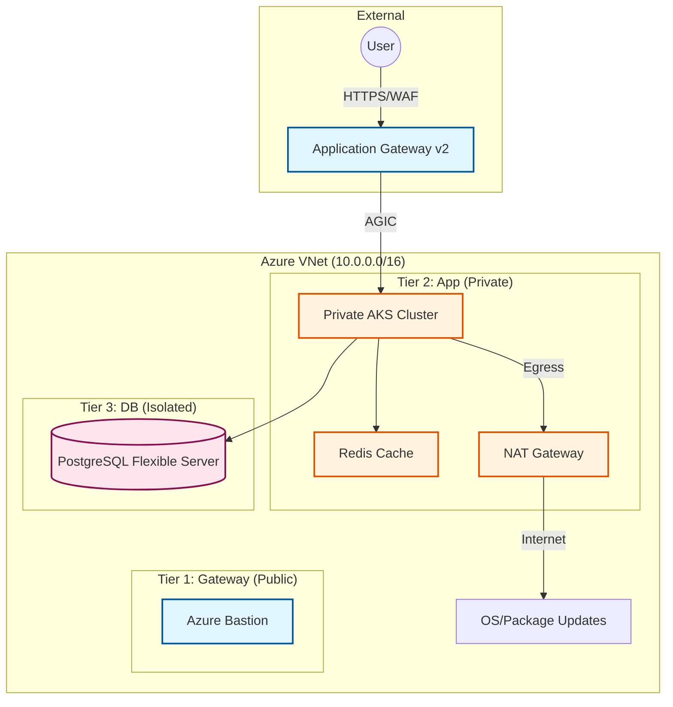

# 🏰 Fortress: Enterprise Azure 3-Tier Architecture

[](https://www.terraform.io/)
[](https://azure.microsoft.com/)
[](https://kubernetes.io/)
[](https://github.com/features/actions)
[](https://nodejs.org/)

**Fortress** is a production-grade, highly secure 3-Tier Virtual Network architecture on Microsoft Azure, fully provisioned via Terraform. It features a private AKS cluster protected by an Application Gateway with WAF, and a state-of-the-art **real-time WebSocket dashboard** for live infrastructure observability.

---

## 🏗️ Architecture Overview

The architecture follows a strict 3-tier separation of concerns, ensuring maximum security and scalability.



### Infrastructure Tiers

1.  **Tier 1: Gateway (Public Subnet)**:
    *   **Application Gateway v2**: L7 Load Balancing with WAF (Web Application Firewall) enabled.
    *   **AGIC**: Integrated Ingress Controller for automated backend synchronization.
    *   **Azure Bastion**: Secure, browser-based SSH/RDP access to internal nodes.
2.  **Tier 2: Application (Private Subnet)**:
    *   **Private AKS**: Kubernetes API and worker nodes are isolated from the public internet.
    *   **Azure Redis Cache**: High-performance caching secured via Private Endpoints.
    *   **NAT Gateway**: Provides a single, predictable IP for secure outbound traffic.
3.  **Tier 3: Database (Isolated Subnet)**:
    *   **PostgreSQL Flexible Server**: Dedicated database tier with zero public access.
    *   **Private DNS**: Seamless internal name resolution within the VNet.

---

## 🚀 Quick Start

The project includes a `Makefile` to orchestrate the entire deployment lifecycle.

### Prerequisites
*   [Terraform](https://www.terraform.io/downloads) >= 1.5.0
*   [Azure CLI](https://docs.microsoft.com/en-us/cli/azure/install-azure-cli) (`az login`)
*   [Docker Desktop](https://www.docker.com/products/docker-desktop)
*   SSH Key at `~/.ssh/id_rsa.pub`

### Deployment Steps

```bash
# 1. Initialize Backend & Networking
make init

# 2. Provision Entire Infrastructure (Terraform)
make infra

# 3. Build & Deploy Dashboard to AKS
make deploy
```

---

## 📊 The "Fortress" Dashboard

The dashboard is a full-stack Node.js application that provides real-time infrastructure metrics and pod scaling visualizations via WebSockets.

| Feature | Description |
| :--- | :--- |
| 📦 **Live Pod Counter** | Real-time replica count with `SCALING` animations. |
| 🖥️ **Pod Card Grid** | Dynamic cards showing Name, IP, Node, and Status. |
| 📜 **Scaling Event Log** | Live terminal feed of HPA events and pod lifecycle. |
| 🕸️ **Network Topology** | Interactive SVG visualization of traffic flow. |
| 🛡️ **Security Scanner** | On-demand infrastructure audit with visual sweep effect. |

### Autoscaling Workflow
1.  **Traffic Spike**: Simulated via `ab` (ApacheBench).
2.  **HPA Detection**: Horizontal Pod Autoscaler detects CPU > 50%.
3.  **AKS Scaling**: Azure CNI provisions new pods; AGIC updates backend pool.
4.  **Live Update**: WebSocket emits data to the UI; Pod cards appear instantly.

---

## 🛡️ Security Posture

*   **Zero Public Exposure**: AKS and Database reside in private/isolated subnets.
*   **WAF Protection**: OWASP rulesets enabled on the Application Gateway.
*   **Managed Identities**: All resources use System/User Assigned Identities (No static secrets).
*   **Network Security Groups (NSG)**: Micro-segmentation enforced at the subnet level.
*   **Private Link**: Inter-service communication stays within the Azure Backbone.

---

## 📁 Project Structure

```bash
.
├── .github/workflows/    # Full CI/CD (Plan on PR, Deploy on Merge)
├── dashboard/            # Node.js + Socket.io + Glassmorphism UI
├── k8s/                  # Kubernetes Manifests (Ingress, HPA, RBAC)
├── networking/           # Terraform Root Module
│   └── modules/          # Reusable modules (AKS, AppGW, DB, etc.)
├── docs/                 # Detailed Technical Documentation
└── Makefile              # Automation Entrypoint
```

---

## 📖 Further Reading

*   [**HOW_TO_RUN.md**](./docs/HOW_TO_RUN.md) - Detailed step-by-step guide.
*   [**ARCHITECTURE.md**](./docs/ARCHITECTURE.md) - Deep dive into component interaction.
*   [**PROJECT_DOCUMENTATION.md**](./docs/PROJECT_DOCUMENTATION.md) - Technical specifications.
*   [**autoscaling_verification.md**](./docs/autoscaling_verification.md) - How to test HPA.

---

