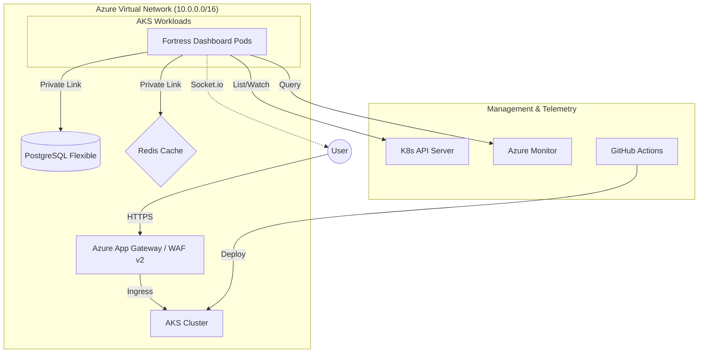

# Fortress Architecture — How It All Works

## Overview
Fortress is a cloud-native monitoring and management hub deployed on Azure using Terraform. It demonstrates a hardened three-tier architecture with real-time telemetry and self-healing capabilities.



## Infrastructure Flow
1. **Internet** → **Application Gateway (WAF-ready)**
2. **App Gateway** → **Private AKS Cluster (K8s)**
3. **AKS Pods** ↔ **Redis Cache & PostgreSQL (Private Link)**
4. **Bastion Host** (Public Subnet) → **Remote Access**

Everything lives inside a single, unified Virtual Network (VNet) and shared Resource Group — providing a private, isolated network on Azure with simplified management.

---

## Folder Structure

```
backend-init/        → Step 1: creates storage for Terraform state
networking/          → Step 2: the actual infrastructure
  main.tf            → calls the modules below
  variables.tf       → all the config options
  terraform.tfvars   → your actual values (gitignored)
  outputs.tf         → prints IPs after deploy
  modules/
    networking/      → VNet, subnets, firewalls
    aks/             → Private Kubernetes Cluster
    app_gateway/     → Edge Security & Layer 7 Load Balancing
    acr/             → Container Image Registry
    database/        → PostgreSQL server
    redis/           → Redis Cache (Standard C1)
    bastion/         → Azure Bastion for secure access
dashboard/               → Custom monitoring dashboard + Node.js real-time API
.github/workflows/   → automatic deploy on GitHub push
```

---

## backend-init/

Before deploying, Terraform needs somewhere to save its state file. This folder creates an Azure Storage Account (like an S3 bucket) for that.

Run this once before anything else.

---

## networking/main.tf

The entry point. It calls 3 modules and passes data between them:

```
main.tf
  calls → module "networking"  → creates VNet, subnets, and shared Resource Group
  calls → module "aks"         → creates private K8s cluster
  calls → module "app_gateway" → creates public entry point
  calls → module "acr"         → creates image registry
  calls → module "database"    → creates isolated database
  calls → module "redis"       → creates private Redis cache
  calls → module "bastion"     → creates secure remote access
  creates → azurerm_storage_account.tfstate → stores terraform state in the same RG
```

Without this file nothing gets deployed.

---

## networking/variables.tf + terraform.tfvars

`variables.tf` declares what settings exist.
`terraform.tfvars` is where you put the actual values.

Key settings:
- `location` — which Azure region (default: Central India)
- `project_name` — prefix for all resource names (default: Fortress-VNet)
- `db_password` — your database password (required, no default)
- `vnet_address_space` — IP range for the network (default: 10.0.0.0/16)

---

## Module: networking

Creates the network foundation.

**vpc.tf** — makes the VNet and 6 subnets:
- 2 public subnets (for Load Balancer and Bastion)
- 2 app subnets (for AKS — private, no direct internet)
- 2 DB subnets (for database — fully isolated)
- 1 Redis subnet (for private data services)

**security.tf** — firewall rules (NSGs) per tier:
- Public: allow HTTP/HTTPS from internet
- App: only allow traffic from inside the network
- DB: only allow PostgreSQL port 5432 from app VMs

**routes.tf** — NAT Gateway so app VMs can reach the internet outbound (for updates etc.) without being reachable inbound.

**variables.tf** — what this module needs as input.
**outputs.tf** — exports subnet IDs and VNet ID for other modules to use.

---

## Dashboard: Real-Time Observability Layer

The dashboard is a **full-stack application** running as a Pod inside AKS:

```
Browser (UI)
   ↕  WebSocket (socket.io)
Node.js Server (server.js)
   ↕  @kubernetes/client-node
Kubernetes API Server
   ↓
Pod list / Events / Node data
```

**Backend** (`server.js`):
- Uses `http` + `socket.io` for real-time bidirectional communication.
- Queries `k8sApi.listNamespacedPod("default")` every **2 seconds** and broadcasts the result to all connected clients via `io.emit("pods", pods)`.
- Loads kubeconfig via `kc.loadFromDefault()` locally, or `kc.loadFromCluster()` when running inside AKS.

**Frontend** (`index.html`):
- `socket.on("pods", ...)` receives live pod snapshots and:
  - Renders a **pod card** per pod in the "Cluster Nodes" tab (status, IP, node name).
  - Updates the **Pod Counter** card on the Overview tab.
  - Detects scaling events (pod count change) and writes `HPA Triggered: Scaling from N → M pods` into the operational log stream.

**Scaling Tag Logic**:
| State | Tag shown | Color |
|-------|-----------|-------|
| Count increased | `SCALING UP` | Amber, animated pulse |
| Count decreased | `SCALING DOWN` | Blue |
| No change | `STABLE` | Default teal |

---

## Module: aks
Creates a private Azure Kubernetes Service (AKS) cluster for containerized workloads. 
- **Networking**: Uses Azure CNI for direct pod-to-vnet IP allocation.
- **AGIC Addon**: Enabled to integrate with the Application Gateway.
- **Managed Identity**: Uses a user-assigned identity for the cluster.

## Module: app_gateway
Creates a Layer 7 Application Gateway v2 as the entry point. 
- **AGIC Integration**: Managed by the AKS Ingress Controller.
- **WAF-ready**: Can be upgraded to WAF_v2 for OWASP protection.
- **Frontend**: Public IP on port 80.

## AGIC Role Assignments
The AGIC integration requires specific permissions for the AKS managed identity to control the Application Gateway:
1. **Contributor**: On the Application Gateway resource.
2. **Network Contributor**: On the Virtual Network (for managing backend pools and subnets).

## Module: acr
Creates an Azure Container Registry to store and manage Docker images. Linked to AKS for seamless image pulling.

---

## Module: database

Creates the PostgreSQL database — fully private.

**database.tf** does 5 things:
1. Creates a dedicated subnet just for PostgreSQL (it needs its own)
2. Creates a Private DNS Zone — so the DB hostname only resolves inside your VNet
3. Links the DNS Zone to the VNet
4. Creates the PostgreSQL Flexible Server v15 (1 vCore, 2GB RAM, 32GB storage, 7-day backups)
5. Creates the actual database inside the server

Nobody outside your VNet can reach this database. No public IP, no public DNS record.

**variables.tf** — inputs: subnet IDs, VNet ID, DB password.
**outputs.tf** — exports: the DB hostname (FQDN).

---

## .github/workflows/deploy.yml

Automates deployment via GitHub Actions.

- **On Pull Request** → runs `terraform plan` and posts the result as a PR comment
- **On merge to main** → runs `terraform apply` automatically

Needs 5 GitHub Secrets to work: 4 Azure credentials + your DB password.

---

## Why variables.tf and outputs.tf in every module?

Modules are isolated — they can't read from or write to each other directly.

- **variables.tf** = the inputs a module accepts (like function parameters)
- **outputs.tf** = the values a module exports (like a function's return value)
- **main.tf** = connects them by passing outputs of one module as inputs to another

---

## Azure Terms — Plain English

| Term | What it means |
|------|--------------|
| VNet | Your private network on Azure. Like your home Wi-Fi. |
| Subnet | A section of the VNet. Each tier gets its own. |
| AKS | Azure Kubernetes Service. Orchestrates your containers. |
| App Gateway | A smart load balancer that works at Layer 7 (HTTP/HTTPS). |
| ACR | Azure Container Registry. Stores your Docker images. |
| Redis | High-speed in-memory data store for caching. |
| Bastion | Secure browser-based SSH/RDP access to private resources. |
| Private DNS Zone | Internal-only DNS. Hostnames only work inside the VNet. |
| Remote Backend | Terraform state stored in Azure instead of locally. |
