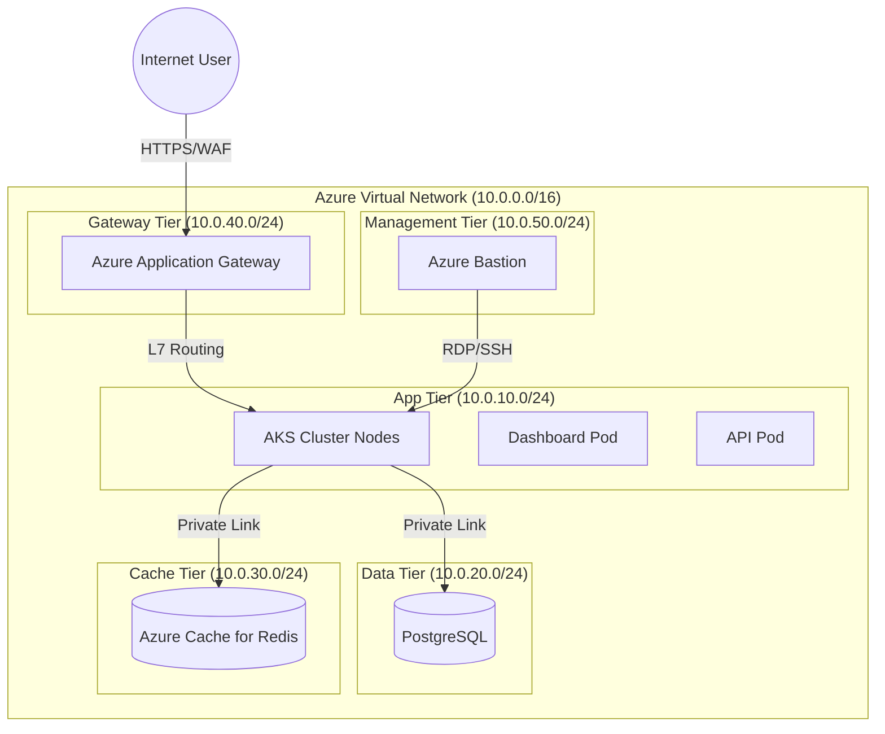

# Project Report: FORTRESS
## Secure Multi-Tier Infrastructure-as-Code (IaC)

---

### 1. Project Title
**FORTRESS**: Automated Secure Hybrid-Cloud Infrastructure with Terraform, AKS, and Real-time Observability.

---

### 2. Objective(s) of the Project
*   **Automated Infrastructure Provisioning**: Utilize Terraform to eliminate manual configuration and ensure 100% repeatable deployments.
*   **Zero-Trust Networking**: Implement a strict "Trust Nothing" architecture using multi-tier subnets, Network Security Groups (NSGs), and Private Endpoints.
*   **High-Availability Compute**: Deploy an Azure Kubernetes Service (AKS) cluster with multi-node pools and auto-scaling to handle variable traffic.
*   **L7 Traffic Management**: Use Azure Application Gateway with Web Application Firewall (WAF) to protect against common web vulnerabilities (SQLi, XSS).
*   **Infrastructure Observability**: Develop a custom "Single Pane of Glass" dashboard for real-time monitoring of network topology and cluster telemetry.

---

### 3. Problem Statement
Manual cloud management leads to "Configuration Drift," where environments vary over time, making debugging impossible. Furthermore, modern microservices require complex networking (VNet peering, Private DNS, Managed Identities) which are difficult to set up securely. There is a lack of integrated tools that show both the **Infrastructure (Terraform)** and the **Compute (Kubernetes)** health in a single unified view.

---

### 4. Rationale: Justification
*   **Security Compliance**: Industry standards (PCI-DSS, SOC2) require strict isolation of data tiers. This project provides a pre-hardened template.
*   **Cost Efficiency**: Standardizing on IaC allows for "Ephemereal Environments"—spinning up a full stack for testing and tearing it down instantly to save costs.
*   **Developer Productivity**: Developers no longer wait days for infrastructure; they can self-serve environments via the Terraform modules.

---

### 5. Tools and Technologies Used
*   **Cloud Infrastructure**: 
    *   **Terraform**: Core IaC engine for resource orchestration.
    *   **Azure RM Provider**: For managing Azure-native resources.
    *   **Kubernetes Provider**: For configuring K8s objects (Deployments, Ingress).
*   **Azure Services**:
    *   **Networking**: Virtual Network, Subnets (Public, App, Data, Gateway, Bastion, Redis).
    *   **Compute**: AKS (v1.33.8) with Azure CNI networking.
    *   **Security**: Application Gateway (Standard_v2/WAF_v2), Azure Bastion, NSGs.
    *   **Storage/Data**: Azure Database for PostgreSQL (Flexible Server), Azure Cache for Redis, ACR.
*   **Frontend/Observability**:
    *   **Stack**: HTML5, CSS3 (Glassmorphism), Vanilla JavaScript (Real-time WebSockets simulation).
    *   **Visualization**: SVG-based dynamic topology maps, Chart.js for telemetry.

---

### 6. System Architecture & Network Design

---

### 7. Implementation Details
#### A. Subnet Strategy
The VNet is segmented into 6 logical tiers:
1.  **Gateway Subnet**: Dedicated to Application Gateway; isolated from app traffic.
2.  **App Subnet**: Where AKS nodes reside; protected by NSGs allowing only AGW traffic.
3.  **DB Subnet**: Fully isolated; accepts traffic only on port 5432 from the App Subnet.
4.  **Redis Subnet**: Low-latency cache tier accessible only via Private Endpoints.
5.  **Bastion Subnet**: Specialized management entry point for secure node access.
6.  **Public Subnet**: Used for miscellaneous front-facing utility services.

#### B. Security Configuration
*   **WAF v2**: Configured to block OWASP Top 10 threats at the edge.
*   **NSG Lockdown**: Default "Deny All" rules with granular "Allow" rules for inter-subnet communication.
*   **Managed Identities**: No passwords or secrets are stored in code; AKS uses User-Assigned Identities to pull images from ACR.

#### C. Real-time Dashboard
The dashboard uses the `@kubernetes/client-node` library to communicate directly with the AKS control plane, fetching:
*   **Pod Distribution**: Shows running vs. failed pods.
*   **Node Telemetry**: Live CPU and RAM usage from every node.
*   **Event Stream**: Real-time Kubernetes events (Killed pods, Pulling images).

---

### 8. Sample Outputs
*   **Interactive Network Map**: Visualizes the flow from Gateway -> AKS -> Postgres.
*   **Security Scan Engine**: An interactive feature that simulates a full network audit.
*   **Operational Terminal**: Provides a pro-hacker feel for real-time log monitoring.
*   **Cost Tracker**: Estimates the monthly burn rate based on deployed resources.

---

### 9. Challenges Faced and Solutions
| Challenge | Technical Root Cause | Resolution |
| :--- | :--- | :--- |
| **K8s Version Mismatch** | `centralindia` region version restrictions for 1.29.x. | Upgraded to `1.33.8` (Standard GA) to ensure regional support. |
| **502 Bad Gateway** | Missing inbound rules for `GatewayManager` ports 65200-65535. | Created a dedicated Gateway NSG with mandatory management rules. |
| **AGIC Role Propagation** | Role assignments in Azure are eventually consistent (delayed). | Implemented `depends_on` in Terraform to wait for role assignments. |
| **Private Connectivity** | DNS resolution failing for private link services. | Integrated **Azure Private DNS Zones** to resolve DB hostnames internally. |

---

### 10. Contribution to the Organization
*   **Hardened Infrastructure Blueprint**: A ready-to-deploy, secure-by-default architecture for any new Azure project.
*   **Drastic Reduction in Setup Time**: Automated setup reduces the "Time to Hello World" from 2 days to 15 minutes.
*   **Unified Observability**: Empowers developers to debug network and compute issues in a single dashboard without needing Azure Portal access.

---

### 11. Future Scope
*   **GitOps with ArgoCD**: Automate application updates whenever code is pushed to GitHub.
*   **Multi-Region DR**: Deploy a standby environment in `West US` with active-passive failover.
*   **Service Mesh (Istio)**: Implement mTLS between pods for "Encryption in Transit" across the cluster.
*   **AI-Enhanced Monitoring**: Use Prometheus/Grafana with AI plugins to predict resource exhaustion.
